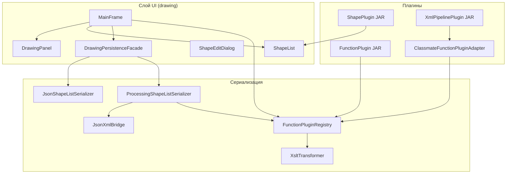

# Подробное описание лабораторной работы №6

Графический редактор фигур с сериализацией, тремя видами подключаемых модулей (JAR) и применением порождающих/структурных паттернов проектирования. Проект развивает решения лабораторных работ №3–№5.

---

## 1. Цель и место в цепочке лабораторных

| Лабораторная | Содержание |
|--------------|------------|
| **№3** | Иерархия фигур, JSON-сериализация (вариант 4), редактирование свойств |
| **№4** | Динамические **shape-плагины** (новые классы фигур, например Star) |
| **№5** | **Функциональные** плагины: обработка XML до/после файла (XSLT, вариант 4) |
| **№6** | **Adapter** для «чужого» API плагинов + **Facade**, **Observer**, **Strategy** |

В lab06 сохранены все возможности предыдущих работ; добавлены адаптация внешних плагинов и явное использование паттернов в коде хост-приложения.

---

## 2. Общая архитектура

Приложение разделено на слои: **данные фигур** → **отрисовка и ввод** → **сериализация** → **плагины**. Пользовательский интерфейс (`MainFrame`) не содержит логики кодеков и XSLT — только вызывает фасад сохранения и загрузки.



### Поток сохранения (файл `.xml`)

1. `ShapeList` → `JsonShapeListSerializer.toJson()` — внутренний JSON.
2. `JsonXmlBridge.jsonToXml()` — канонический XML `<shapes><shape type="…">…</shape></shapes>`.
3. `FunctionPluginRegistry.applyBeforeSave()` — по очереди все **включённые** процессоры (XSLT и адаптированные classmate-плагины).
4. Запись текста в файл.

### Поток загрузки (файл `.xml`)

1. Чтение файла.
2. `FunctionPluginRegistry.applyAfterLoad()` — процессоры в **обратном** порядке.
3. `JsonXmlBridge.xmlToJson()` → `JsonShapeListSerializer.fromJson()` → заполнение `ShapeList`.

Файлы **`.json`** загружаются напрямую в JSON-модель, минуя XML-пайплайн (совместимость с lab 3).

---

## 3. Паттерны проектирования (lab 6)

### 3.1. Adapter (адаптер) — основное задание lab 6

**Проблема:** «Плагин товарища» реализован под другой интерфейс (`classmate.api.XmlPipelinePlugin`: методы `onExport` / `onImport`), а хост умеет работать только с `plugin.functional.FunctionPlugin` (`processBeforeSave` / `processAfterLoad`).

**Решение:** класс `plugin.adapter.ClassmateFunctionPluginAdapter` реализует `FunctionPlugin` и делегирует вызовы объекту `XmlPipelinePlugin`.

**Загрузка:** `plugin.ClassmatePluginLoader` читает JAR из `classmate-plugins/`, находит реализации через `ServiceLoader`, оборачивает адаптером и регистрирует в общем `FunctionPluginRegistry`. Для UI и пайплайна это обычный функциональный плагин.

### 3.2. Facade (фасад)

**Класс:** `drawing.persistence.DrawingPersistenceFacade`

**Назначение:** единая точка `save()` / `load()` для `MainFrame`. Скрывает выбор JSON vs XML, вызов `ProcessingShapeListSerializer` и правила расширений файлов.

### 3.3. Observer (наблюдатель)

**Классы:** `drawing.observer.ShapeListObserver`, наблюдаемый `drawing.ShapeList`

**Назначение:** при `addShape`, `removeAt`, `clear` список уведомляет подписчиков. `MainFrame` обновляет JList, `DrawingPanel` перерисовывает холст — инструменты рисования не вызывают методы UI напрямую.

### 3.4. Strategy (стратегия)

**Классы:** `tools.Tool` (стратегия), `tools.ToolStrategyContext` (контекст)

**Назначение:** алгоритм обработки мыши (линия, прямоугольник, звезда из плагина и т.д.) подставляется в runtime через `DrawingPanel.setTool()`. Каждый `*Tool` — отдельная стратегия создания фигуры.

---

## 4. Три типа подключаемых модулей

| Тип | API | Каталог JAR | Загрузчик | Назначение |
|-----|-----|-------------|-----------|------------|
| **Shape** | `plugin.ShapePlugin` | `plugins/` | `plugin.PluginLoader` | Новый класс фигуры, кодек, рендерер, редактор свойств, инструмент на панели |
| **Functional** | `plugin.functional.FunctionPlugin` | `function-plugins/` | `plugin.functional.FunctionPluginLoader` | XSLT-трансформации XML до сохранения и после загрузки |
| **Classmate** | `classmate.api.XmlPipelinePlugin` | `classmate-plugins/` | `plugin.ClassmatePluginLoader` + **Adapter** | Внешний API; в хосте превращается в `FunctionPlugin` |

Регистрация shape-компонентов вынесена в `drawing.ApplicationBootstrap` (встроенные 6 фигур + всё, что добавили JAR).

Функциональные и classmate-плагины попадают в **Settings** как чекбоксы (включить/выключить обработку).

---

## 5. Структура каталогов (корень `lab06/`)

```
lab06/
├── ОПИСАНИЕ.md          ← этот документ
├── README.md            ← краткая справка (сборка, запуск, тесты)
├── build.sh             ← сборка приложения и всех JAR-плагинов
├── sources.txt          ← список .java хоста (генерируется при сборке)
│
├── shapes/              ← иерархия фигур (данные)
├── rendering/           ← отрисовка
├── tools/               ← инструменты мыши (Strategy)
├── editing/             ← редактирование свойств в диалоге
├── serialization/       ← JSON/XML, кодеки, пайплайн
├── drawing/             ← Swing UI, список фигур, тесты
├── plugin/              ← API и загрузчики shape/functional плагинов
├── classmate/           ← стабильный API для «чужих» плагинов
│
├── plugins/             ← собранные shape-плагины (*.jar)
├── function-plugins/    ← собранные functional-плагины (*.jar)
├── classmate-plugins/   ← собранные classmate-плагины (*.jar)
├── plugins-src/         ← исходники плагинов для сборки
└── examples/            ← пример JSON-файла
```

Каталоги `plugins/`, `function-plugins/`, `classmate-plugins/` создаются скриптом `build.sh`. При старте `MainFrame` автоматически загружает все `*.jar` из этих папок.

Подкаталоги `plugins-src/*/build/` — артефакты компиляции плагинов, в репозиторий обычно не коммитятся (могут появиться после `./build.sh`).

---

## 6. Пакеты и файлы хост-приложения

### 6.1. `shapes/` — предметная модель

| Файл | Назначение |
|------|------------|
| `Shape.java` | Абстрактный базовый класс; метод `getDisplayName()` для списка в UI |
| `Line.java` | Отрезок (x1, y1, x2, y2) |
| `Rectangle.java` | Прямоугольник (x, y, width, height) |
| `Ellipse.java` | Эллипс (ограничивающий прямоугольник) |
| `Triangle.java` | Треугольник (три вершины) |
| `Square.java` | Квадрат (наследник Rectangle) |
| `Circle.java` | Круг (наследник Ellipse) |

Классы **не рисуют** себя сами — только хранят координаты (принцип lab 2–3). Поля изменяемые (setters) для диалога редактирования.

---

### 6.2. `rendering/` — отрисовка

| Файл | Назначение |
|------|------------|
| `ShapeRenderer.java` | Интерфейс: `render(Graphics2D, Shape)` |
| `LineRenderer.java` | Рисует `Line` |
| `RectangleRenderer.java` | Рисует `Rectangle` и наследников с тем же способом (Square) |
| `EllipseRenderer.java` | Рисует `Ellipse` / `Circle` |
| `TriangleRenderer.java` | Рисует `Triangle` |
| `RendererRegistry.java` | Карта «класс фигуры → рендерер»; поиск с подъёмом по иерархии классов |

Рендереры для плагинных фигур (Star) регистрируются в `ShapePlugin` или в bootstrap при загрузке JAR.

---

### 6.3. `tools/` — создание фигур мышью (Strategy)

| Файл | Назначение |
|------|------------|
| `Tool.java` | Интерфейс стратегии: press/drag/release, preview |
| `ToolStrategyContext.java` | Контекст Strategy: хранит активный `Tool`, переключает стратегию |
| `LineTool.java` | Линия: drag от точки к точке |
| `RectangleTool.java` | Прямоугольник по двум углам |
| `EllipseTool.java` | Эллипс по ограничивающему rect |
| `TriangleTool.java` | Три клика — три вершины |
| `SquareTool.java` | Квадрат с равными сторонами |
| `CircleTool.java` | Круг: центр + радиус |

После создания фигура добавляется в `ShapeList`; Observer обновляет UI.

---

### 6.4. `editing/` — редактирование свойств

| Файл | Назначение |
|------|------------|
| `PropertyField.java` | Описание одного поля (ключ, подпись, значение) |
| `PropertyEditor.java` | Интерфейс: `readFields` / `applyFields` для типа фигуры |
| `PropertyEditorRegistry.java` | Список редакторов; поиск по `supports(shape)` без switch |
| `editors/*PropertyEditor.java` | Редакторы для Line, Rectangle, Ellipse, Triangle, Square, Circle |

Используется в `drawing.ShapeEditDialog`.

---

### 6.5. `serialization/` — сохранение и загрузка

| Файл / каталог | Назначение |
|----------------|------------|
| `ShapeCodec.java` | Интерфейс кодека: `toMap` / `fromMap`, имя типа `type` в JSON |
| `ShapeCodecRegistry.java` | Реестр кодеков по имени типа и по экземпляру фигуры |
| `codecs/*.java` | Кодеки встроенных 6 фигур |
| `json/JsonValue.java` | Минимальный парсер/генератор JSON (без внешних библиотек) |
| `JsonShapeListSerializer.java` | Список фигур ↔ JSON-строка / `.json` файл |
| `xml/JsonXmlBridge.java` | Преобразование JSON списка фигур ↔ XML для XSLT |
| `xml/XsltTransformer.java` | Применение XSLT 1.0 к строке XML |
| `ProcessingShapeListSerializer.java` | Полный пайплайн: JSON → XML → плагины → файл и обратно |

---

### 6.6. `drawing/` — пользовательский интерфейс

| Файл | Назначение |
|------|------------|
| `MainFrame.java` | Главное окно: меню File/Plugins/Settings, панели, загрузка всех JAR |
| `DrawingPanel.java` | Холст: мышь → `ToolStrategyContext`, отрисовка через `RendererRegistry` |
| `ShapeList.java` | Observable-контейнер фигур |
| `observer/ShapeListObserver.java` | Интерфейс наблюдателя за списком |
| `ShapeEditDialog.java` | Модальный диалог свойств выбранной фигуры |
| `ApplicationBootstrap.java` | Регистрация встроенных рендереров, кодеков, редакторов, tools; реализует `PluginContext` |
| `persistence/DrawingPersistenceFacade.java` | Facade сохранения/загрузки |
| `SerializationSmokeTest.java` | Тест JSON round-trip (6 фигур) |
| `FunctionPipelineSmokeTest.java` | Тест XML + XSLT functional plugins |
| `AdapterPatternSmokeTest.java` | Тест classmate header через Adapter |
| `PluginLoadSmokeTest.java` | Тест загрузки shape-плагина Star |

---

### 6.7. `plugin/` — инфраструктура shape- и functional-плагинов

| Файл | Назначение |
|------|------------|
| `ShapePlugin.java` | Точка входа shape-JAR: `register(PluginContext)` |
| `PluginContext.java` | API хоста: registerCodec, registerRenderer, registerTool, … |
| `PluginLoader.java` | `URLClassLoader` + `ServiceLoader<ShapePlugin>` из `plugins/` |
| `functional/FunctionPlugin.java` | Интерфейс обработки XML (before save / after load) |
| `functional/FunctionPluginRegistry.java` | Реестр, флаги enabled, цепочка transform |
| `functional/FunctionPluginLoader.java` | Загрузка JAR из `function-plugins/` |
| `adapter/ClassmateFunctionPluginAdapter.java` | **Adapter** XmlPipelinePlugin → FunctionPlugin |
| `ClassmatePluginLoader.java` | Загрузка classmate-JAR, регистрация через адаптер |

---

### 6.8. `classmate/api/` — контракт «чужого» плагина

| Файл | Назначение |
|------|------------|
| `XmlPipelinePlugin.java` | Внешний API: `onExport`, `onImport`, метки для Settings |

Исходники classmate-плагинов компилируются с `-cp lab06` и **не** включают этот класс в JAR повторно — он загружается из classloader хоста (родительский loader).

---

## 7. Каталоги с собранными плагинами

### `plugins/`

Готовые **shape**-модули. По умолчанию после сборки:

| JAR | Содержимое |
|-----|------------|
| `star-plugin.jar` | Фигура Star, инструмент, кодек, рендерер, редактор |

### `function-plugins/`

**Нативные** functional-плагины (`FunctionPlugin`), XSLT (lab 5, вариант 4):

| JAR | Эффект (кратко) |
|-----|-----------------|
| `metadata-xslt.jar` | Элемент `<metadata savedAt="…"/>` |
| `sort-shapes-xslt.jar` | Сортировка `<shape>` по `@type` |
| `wrap-drawing-xslt.jar` | Обёртка `<drawing version="1">` (по умолчанию выкл.) |

### `classmate-plugins/`

Плагины с API **`XmlPipelinePlugin`** (lab 6, имитация «модуля товарища»):

| JAR | Эффект |
|-----|--------|
| `classmate-header.jar` | XML-комментарий в начале файла |
| `classmate-uuid.jar` | Тег `<classmate-uuid id="…"/>` внутри `<shapes>` |

В меню Settings отображаются с пометкой **(classmate via Adapter)**.

---

## 8. Каталог `plugins-src/` — исходники для сборки JAR

| Подкаталог | Собирается в | Сервис (`META-INF/services/`) |
|------------|--------------|-------------------------------|
| `star-plugin/` | `plugins/star-plugin.jar` | `plugin.ShapePlugin` → `plugin.star.StarPlugin` |
| `func-metadata/` | `function-plugins/metadata-xslt.jar` | `plugin.functional.FunctionPlugin` |
| `func-sort/` | `function-plugins/sort-shapes-xslt.jar` | `plugin.functional.FunctionPlugin` |
| `func-wrap/` | `function-plugins/wrap-drawing-xslt.jar` | `plugin.functional.FunctionPlugin` |
| `classmate-header/` | `classmate-plugins/classmate-header.jar` | `classmate.api.XmlPipelinePlugin` |
| `classmate-uuid/` | `classmate-plugins/classmate-uuid.jar` | `classmate.api.XmlPipelinePlugin` |

Типичная структура одного плагина:

```
plugins-src/<имя>/
├── META-INF/services/<полное имя интерфейса>   # одна строка — класс реализации
├── plugin/... или classmate/plugins/...       # класс, реализующий интерфейс
└── (для shape) shapes/, rendering/, tools/, serialization/, editing/
```

Скрипт `build.sh`:

1. Компилирует все `.java` хоста (кроме `plugins-src/**`).
2. Для каждого плагина: `javac -cp $ROOT`, копирует `META-INF`, упаковывает `jar`.

---

## 9. Прочие файлы в корне

| Файл | Назначение |
|------|------------|
| `build.sh` | Единая сборка хоста и всех плагинов |
| `README.md` | Краткое руководство на английском |
| `examples/shapes.json` | Пример файла с 6 встроенными типами фигур |

---

## 10. Запуск и сценарии использования

### Сборка

```bash
cd lab06
chmod +x build.sh
./build.sh
```

### Запуск редактора

```bash
java drawing.MainFrame
```

Опционально:

```bash
java -Dplugins.dir=/path/to/shapes java drawing.MainFrame
java -Dfunction.plugins.dir=/path/to/func java drawing.MainFrame
java -Dclassmate.plugins.dir=/path/to/classmate java drawing.MainFrame
java drawing.MainFrame path/to/extra-plugin.jar
```

### Меню приложения

| Меню | Действие |
|------|----------|
| **File → Save/Load** | Сохранение через `DrawingPersistenceFacade` (`.xml` с пайплайном или `.json`) |
| **Plugins** | Загрузка JAR shape / functional / classmate; перезагрузка папок |
| **Settings** | Включение/отключение каждого functional и адаптированного classmate-плагина |

### Автотесты (без GUI)

```bash
java drawing.SerializationSmokeTest
java drawing.FunctionPipelineSmokeTest
java drawing.AdapterPatternSmokeTest
```

---

## 11. Расширение без изменения ядра

| Задача | Действие |
|--------|----------|
| Новая фигура | JAR с `ShapePlugin`, положить в `plugins/` |
| Новая XSLT-обработка | JAR с `FunctionPlugin`, положить в `function-plugins/` |
| «Чужой» формат API | JAR с `XmlPipelinePlugin`, положить в `classmate-plugins/` — хост подключит через Adapter |

Реестры (`ShapeCodecRegistry`, `FunctionPluginRegistry`, `RendererRegistry`) используют перебор и карты, без `switch` по типам и без reflection для диспетчеризации фигур (требование lab 3).

---

## 12. Зависимости и требования

- **Java 11+** ( `Files.readString`, `writeString` ).
- Стандартная библиотека: Swing (UI), JAXP (XML, XSLT), `ServiceLoader` (плагины).
- Внешние Maven/Gradle-зависимости не используются.

---

## 13. Связь файлов при одном сохранении (итоговая схема)

```
Пользователь: File → Save (shapes.xml)
    → DrawingPersistenceFacade.save()
        → JsonShapeListSerializer.toJson(ShapeList)
        → JsonXmlBridge.jsonToXml(json)
        → FunctionPluginRegistry.applyBeforeSave(xml)
            → [Metadata XSLT]
            → [Sort XSLT]
            → [Classmate Header via Adapter]
            → … другие включённые плагины
        → запись на диск
```

При загрузке цепочка after-load выполняется в обратном порядке, затем XML снова превращается в JSON и в объекты `Shape`.

---

*Документ описывает состояние проекта lab06 после выполнения лабораторных работ №3–№6.*
